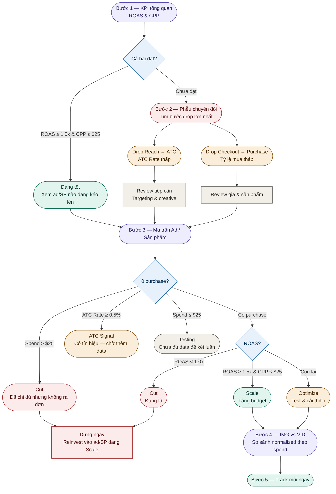

# POD Ad Performance — Hướng Dẫn Đọc Dashboard

Dashboard này giúp bạn xác định đúng vấn đề, và action nhanh hơn.

---

## Cấu trúc flow đọc dashboard



---

## Bước 1 — KPI tổng quan

**Câu hỏi:** Chiến dịch đang ở đâu so với kỳ vọng?

| KPI | Mục tiêu |
|---|---|
| ROAS | ≥ 1.5x |
| Cost Per Purchase (CPP) | ≤ $25 |

- Cả hai đạt → đi thẳng Bước 3 để xem ad/SP nào đang kéo lên.
- Một trong hai chưa đạt → đi tiếp Bước 2.

---

## Bước 2 — Phễu chuyển đổi

**Câu hỏi:** Budget đang bị mất ở bước nào?

```
Impressions → Reach → ATC → Checkout → Purchase
```

**Nếu drop ở Reach → ATC (ATC Rate thấp):**
Review phần tiếp cận — targeting và creative có đang đến đúng người không.

**Nếu drop ở Checkout → Purchase:**
Review giá và sản phẩm — khách đã quan tâm nhưng không mua.

> ATC Rate = ATC ÷ Reach

---

## Bước 3 — Ma trận Ad / Sản phẩm

**Câu hỏi:** Ad nào / SP nào đang ở trạng thái nào?

Xem từng ad và từng sản phẩm theo logic sau:

```
Nếu 0 purchase:
  ├── Spend > $25              → Cut        (đã chi đủ nhưng không ra đơn)
  ├── ATC Rate ≥ 0.5%          → ATC Signal (có tín hiệu, chờ thêm data)
  └── Spend ≤ $25              → Testing    (chưa đủ data để kết luận)

Nếu có purchase:
  ├── ROAS < 1.0x              → Cut        (đang lỗ)
  ├── ROAS ≥ 1.5x & CPP ≤ $25 → Scale      (tăng budget)
  └── Còn lại                  → Optimize   (test & cải thiện)
```

| Nhãn | Hành động |
|---|---|
| Cut | Dừng ngay, reinvest vào ad/SP đang Scale |
| ATC Signal | Giữ nguyên, theo dõi thêm 1–2 ngày |
| Testing | Giữ budget thấp, chờ đủ data |
| Scale | Tăng budget, giữ nguyên những gì đang chạy |
| Optimize | Test creative mới, review giá |

> **Note:** Đây là framework mô tả chung. Mỗi sản phẩm và chiến dịch sẽ có ngưỡng định nghĩa khác nhau — ví dụ sản phẩm giá cao có thể cần spend > $50 mới đủ data, hoặc ATC Rate threshold có thể khác tùy niche.

---

## Bước 4 — IMG vs VID

**Câu hỏi:** Format nào đang hiệu quả hơn?

So sánh theo spend — không so raw volume.

- CPM của IMG thấp hơn → dùng IMG để test sản phẩm mới.
- CVR của VID cao hơn → khi sản phẩm đã có tín hiệu tốt, chuyển sang VID.
- Chênh lệch nhỏ → chưa kết luận, cần xem thêm theo niche hoặc spend tier.

---

## Bước 5 — Track mỗi ngày và action

Không đợi cuối tuần hay cuối tháng mới review.

- Ad/SP nào đạt → giữ và scale dần.
- Ad/SP nào không đạt → tắt ngay, không để chạy thêm.
- Reinvest ngân sách vừa giải phóng vào những gì đang hoạt động.

---

## Công thức tính nhanh

| Chỉ số | Công thức |
|---|---|
| ROAS | Revenue ÷ Spend |
| CPP | Spend ÷ Purchases |
| ASP | Revenue ÷ Purchases |
| ATC Rate | ATC ÷ Reach |
